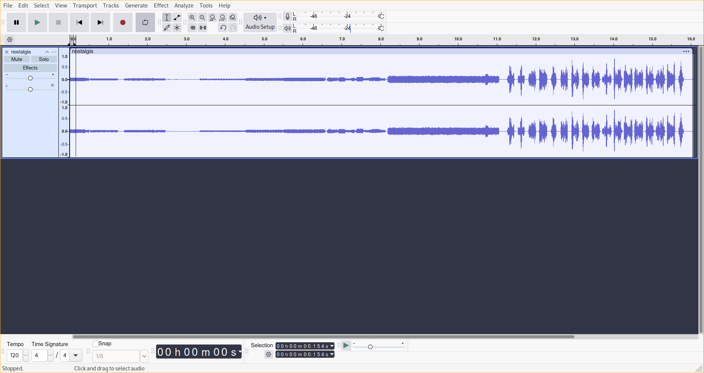

# Clear The Line BSides Cache 2024
---

## Introduction

In this challenge, we are provided with an audio file, specifically a .wav file.

---

## Solution

When playing the file in Audacity, we hear dial up noises, followed by some strage warbles.

With knowledge of previous CTFs and internet puzzles, this seems to be a pretty obvious spectrogram. Right clicking the track and changing view to spectrogram gives us the flag.

---

# Writeup by Fr3ki
[github](https://github.com/Fr3ki)  [x](https://x.com/Fr3ki_)  [blog](https://fr3ki.xyz)
