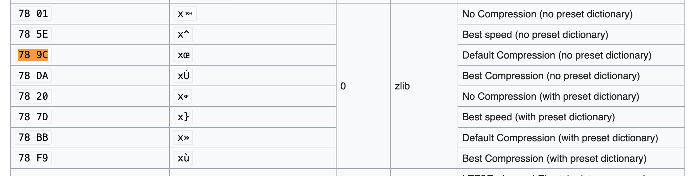

# Memelord

Writeup by 0xfeeb

## Description

The setup for the challenge was as follows:

In this case, it's necessary to download the original image:

## Solution

The first step someone might take is to run strings and other public stego tools against the image, to try to discover low-hanging fruit.

If you run strings against the file, you may have found a "flag" string, which you could further inspect with a hex editor:

It's not immediately obvious what this is, so let's go to the PNG spec. And by PNG spec... I mean [Wikipedia](https://en.wikipedia.org/wiki/PNG#File_format), which is way easier to read than [the RFC](https://datatracker.ietf.org/doc/html/rfc2083) =)

The Wikipedia entry describes the file header, and then the chunks that make up the bulk of the metadata and image data in the PNG file. A chunk consists of:

* A 4-byte length (big endian)
* A 4-byte "type"
* "length" bytes of data
* a 4-byte checksum

The Wikipedia article also describes the importance of case in the 4-byte type - read [those descriptions](https://en.wikipedia.org/wiki/PNG#%22Chunks%22_within_the_file) to understand why "flag" is written as "flAg".

If we look to our output from the hex editor, the "flAg" chunk is as follows:

* `00 00 00 21` (length = 33 bytes)
* `66 6c 41 67` ("f l A g")
* `78 9c 4b cb 49 4c af 0e ce 48 75 c9 4f 2d ce 2b 71 2d 4b cd 73 cf f7 48 2d 4a ad 05 00 80 88 09 e8` (data)
* `0e 5c 07 28` (checksum)

Interestingly, the data is not quite usable yet. We can [look up the first two bytes](https://en.wikipedia.org/wiki/List_of_file_signatures) to determine whether they are known magic bytes, and sure enough:

Our data is zlib-compressed!

> Note: [Zlib uses "DEFLATE" (i.e. zlib) compression](https://en.wikipedia.org/wiki/PNG#Compression) in data chunks, with a byte reserved in the IHDR chunk for future support. Check out the IDAT chunk that follows our flAg chunk, and you'll see its data starts with `78 01`, the zlib designation for uncompressed data.

We can run the data through [CyberChef](https://gchq.github.io/CyberChef/#recipe=From_Hex('Auto')Zlib_Inflate(0,0,'Adaptive',false,false)&input=NzggOWMgNGIgY2IgNDkgNGMgYWYgMGUgY2UgNDggNzUgYzkgNGYgMmQgY2UgMmIgNzEgMmQgNGIgY2QgNzMgY2YgZjcgNDggMmQgNGEgYWQgMDUgMDAgODAgODggMDkgZTg) to get our final answer:

## Parting thoughts

This is custom stego! See if you can write a tool that (1) creates this stego, and (2) extracts it from stego'd PNG files!
