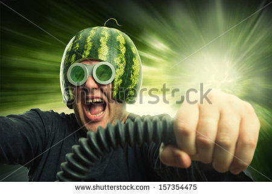
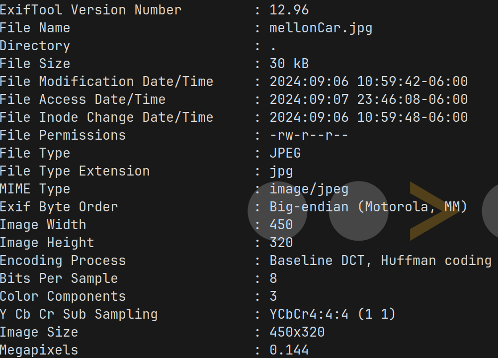
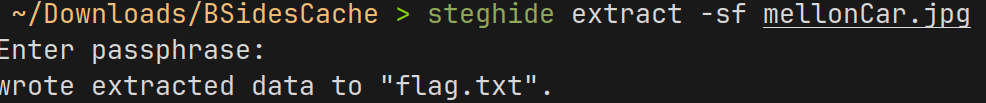

# Triceratops BSides Cache 2024

---

## Introduction

In this challenge, we are provided with a png containing a *wild* stock image of a man with a watermellon helmet driving a car.

---

## Solution

When provided an image in a CTF/Puzzle, there is typically data hidden either steganographically or within the metadata.

Starting with exiftool to check the metadata does not show much of interest.

Moving on to steghide via the command:

`steghide extract -sf`

where the s flag specifies the file, and the f flag being force.

This results in a prompt for a password. Initially I tried triceratops, both capitalized and not, to no avail.

I actually began to create a password list via the crunch tool, which would take the input phrase and create possible passwords. I did this with the idea that I would write a python script to brute-force the password.

It was about five minutes into calculating the list that I realized I had not tried the common defaults. Re-running the command and simply pressing enter when prompted for a password returns "wrote extracted data to flag.txt"

Using cat on the file output by steghide prints the flag.

---

## Lessons Learned

Always remember to try the obvious when presented with a password prompt to avoid any possible overcomplications.

* *blank*
* password
* admin
* root
* etc.

---

# Writeup by Fr3ki
[github](https://github.com/Fr3ki)  [x](https://x.com/Fr3ki_)  [blog](https://fr3ki.xyz)
